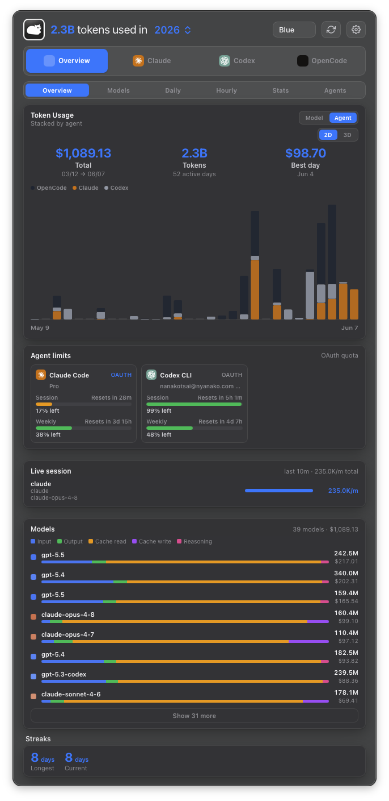
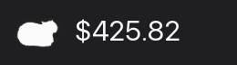
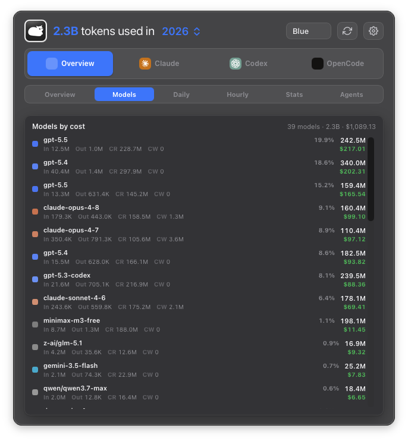
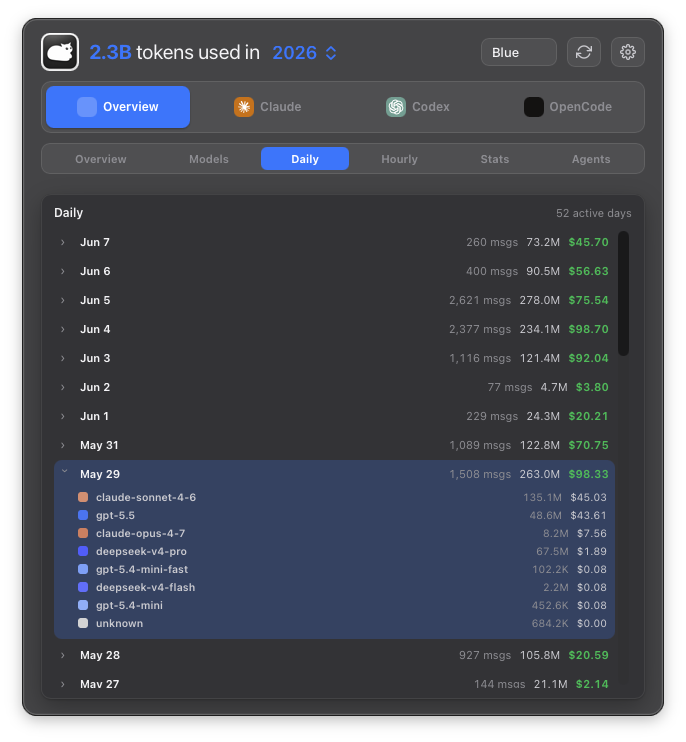
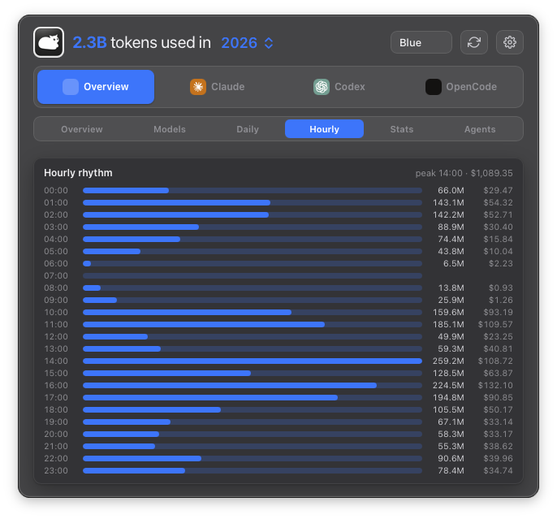
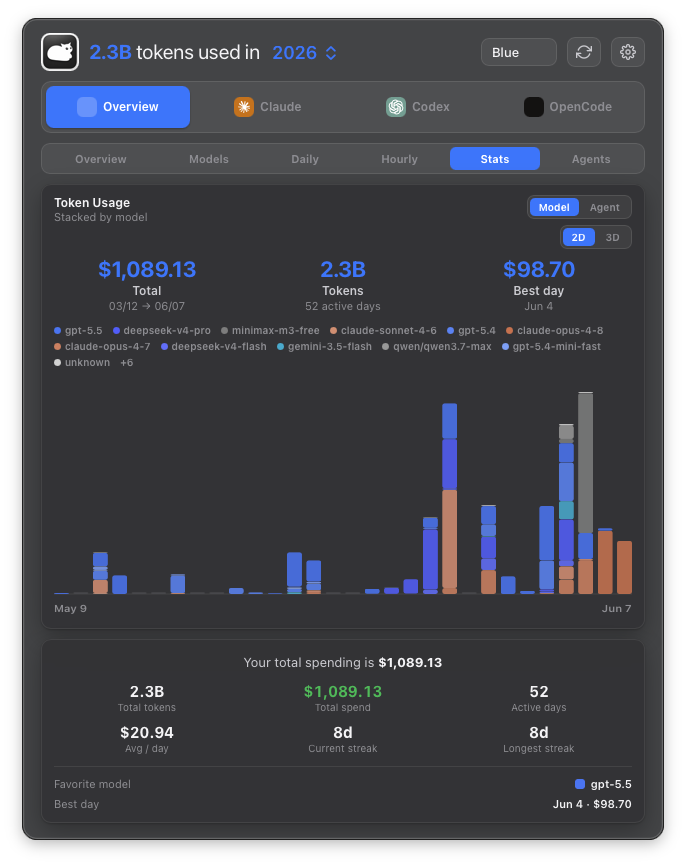
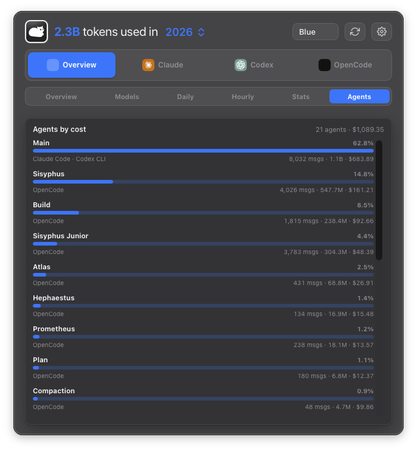
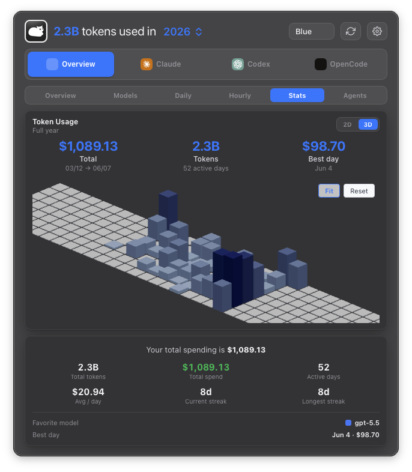
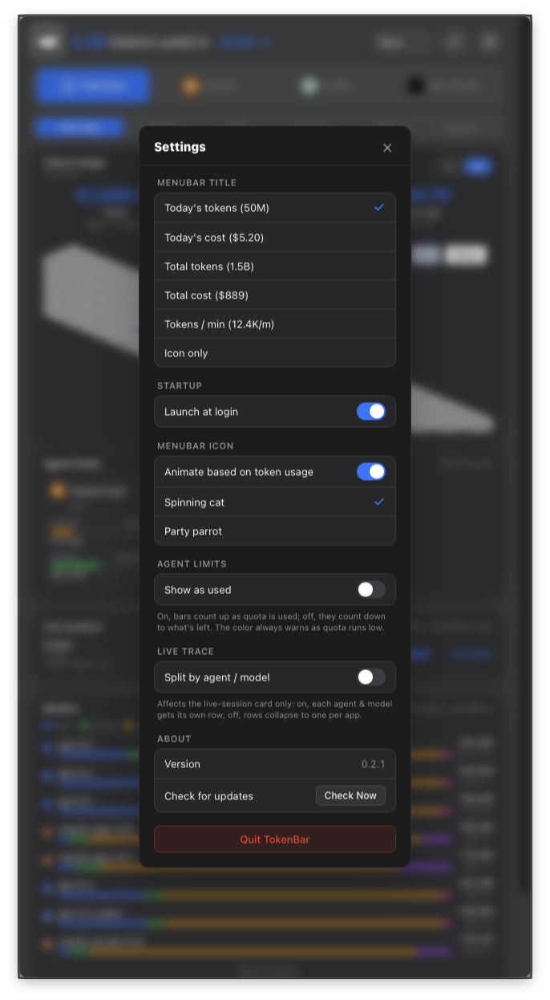

<h1 align="center">TokenBar</h1>

<p align="center">
  <strong>당신의 AI 토큰 사용량, macOS 메뉴바에서 한눈에.</strong>
</p>

<p align="center">
  <a href="README.md">English</a> ·
  <a href="README.zh-TW.md">繁體中文</a> ·
  <strong>한국어</strong>
</p>

<p align="center">
  
  
  
  
</p>

<br>

**TokenBar**는 macOS 메뉴바에 상주하는 로컬 우선(local-first) **AI 토큰 사용량 모니터**입니다. Dock 아이콘 없이 메뉴바에 머무르며 텔레메트리·계정·클라우드 동기화 없이, 기기 안에서 로컬 AI 코딩 세션 로그를 읽어 **25종 이상의 AI 코딩 에이전트**(Claude Code, Codex CLI, Cursor, OpenCode, Gemini CLI, Copilot CLI, Amp, Droid, Hermes, Goose, Kilo/KiloCode, Roo Code, Qwen, Kimi, Crush, Zed, Kiro, Trae, Warp 등)에 쓴 비용을 보여줍니다.

<p align="center">
  
</p>

메뉴바 타이틀은 자유롭게 설정할 수 있습니다 — 오늘의 토큰, 오늘의 비용, 누적 합계, live tokens/min, 또는 아이콘만. 그리고 **메뉴바 고양이는 토큰을 더 많이 태울수록 더 빠르게 회전합니다** — 한 마리 생물로 표현된 토큰 처리량이죠. 이 회전하는 고양이는 원작 [tokcat](https://github.com/handlecusion/tokcat)(**handlecusion**)의 시그니처 아이디어이며, 감사한 마음으로 그대로 이어받았습니다.

<p align="center">
  
</p>

---

## 대시보드

메뉴바 아이콘을 클릭하면 frosted glass popover가 열립니다. 한 줄의 **앱 탭**(Overview / Claude / Codex / …)은 **어떤** 에이전트를 볼지 걸러주고, **뷰 전환** 줄은 그 데이터를 **어떻게** 분해할지 고릅니다 — [tokscale](https://github.com/junhoyeo/tokscale)의 TUI에서 영감을 받았습니다.

| 뷰 | 보여주는 것 |
|---|---|
| **Overview** | 컨트리뷰션 차트(2D 누적 토큰 막대 또는 인터랙티브 3D GitHub 스타일 연간 그래프), agent limits, Live session 트레이스, model 분해, 스트릭 |
| **Models** | 비용순으로 정렬된 모든 model, 비용 비중과 흐릿한 `In · Out · CR · CW` 토큰 분할 표시 |
| **Daily** | 활동한 날을 최신순으로; 특정 날을 선택하면 그 날의 model별 분해로 드릴다운 |
| **Hourly** | 하루 24시간 리듬 — 하루 중 어느 시간대에 실제로 토큰을 쓰는지 |
| **Stats** | 컨트리뷰션 그래프 + 핵심 요약: 누적 비용, 활동 일수, 스트릭, 최애 model, 최고 사용일 |
| **Agents** | 비용순으로 정렬된 서브 에이전트, 출처 앱·메시지 수·토큰 표시 |

<table>
  <tr>
    <td align="center"><br><sub><b>Models</b> — 비용순</sub></td>
    <td align="center"><br><sub><b>Daily</b> — 일자별 드릴다운</sub></td>
  </tr>
  <tr>
    <td align="center"><br><sub><b>Hourly</b> — 24시간 리듬</sub></td>
    <td align="center"><br><sub><b>Stats</b> — 핵심 요약</sub></td>
  </tr>
  <tr>
    <td align="center"><br><sub><b>Agents</b> — 서브 에이전트 비용순</sub></td>
    <td align="center"><br><sub><b>3D</b> — GitHub 스타일 연간 그래프</sub></td>
  </tr>
</table>

컨트리뷰션 차트는 **model**별(tokscale 스타일의 provider 음영)로 또는 **agent**별(브랜드 색)로 누적할 수 있으며, 차트 헤더에서 전환합니다. agent limit 막대는 남은 quota에 따라 색이 바뀌고, 사용한 양으로 **올려 세기**(used) 또는 남은 양으로 **내려 세기**(left)를 고를 수 있습니다(Settings → Agent limits).

<p align="center">
  
</p>

---

## 설치

```sh
brew install --cask nanako0129/tokenbar/tokenbar
```

> 완전한 `owner/tap/cask` 형식은
> [nanako0129/homebrew-tokenbar](https://github.com/Nanako0129/homebrew-tokenbar)를
> 자동으로 tap 합니다 — 별도의 `brew tap` 단계가 필요 없습니다(Homebrew는 tap owner를 소문자로 처리합니다).

GitHub Releases에는 인앱 업데이터가 사용하는 서명된 app archive가 올라갑니다. 무료 설치 경로로는 Homebrew cask를 권장합니다. 앱을 설치하고, notarize되지 않은 이 빌드의 macOS 다운로드 quarantine을 제거합니다.

인앱 업데이터는 실행 시 + 30분마다 GitHub Releases를 확인합니다. 서명된 아티팩트는 내장된 공개키로 검증된 뒤 설치됩니다.

---

## 동작 방식

TokenBar는 **Tauri 2** 앱입니다: Rust 셸 + React/Vite 프론트엔드. 모든 세션 파싱·중복 제거·비용 계산은 **`tokscale-core`**(`vendor/tokscale-core`에 vendored)에 위임하므로, tokscale가 지원하는 모든 에이전트가 한 번에 켜지고 성숙한 LiteLLM/OpenRouter 가격이 적용됩니다. Rust 백엔드는:

- 로컬 로그에서 컨트리뷰션 그래프를 생성하고(`usage_graph.rs` → `tokscale_core::generate_local_graph_report`),
- live tokens/min 속도와 트레이스를 샘플링하고(`usage_tail.rs` → `tokscale_core::parse_local_clients`, 캐시 기반),
- model별 리포트를 생성하고(`model_report.rs` → `tokscale_core::get_model_report`),
- 시간별·에이전트별 리포트를 생성하며(`hourly_report.rs`, `agents_report.rs`),
- Claude/Codex의 OAuth rate-limit window를 가져옵니다(`agent_usage.rs`).

사용량 히스토리는 디스크의 세션 로그에서 로컬로 읽습니다. 텔레메트리·클라우드 동기화·계정이 없습니다. 네트워크 요청은 GitHub Releases 업데이터 매니페스트와 공개 model 가격 데이터로 제한됩니다.

---

## 소스에서 빌드

Rust(stable)와 Node ≥ 22가 필요합니다.

```sh
npm install
npm run tauri:dev      # 개발 모드 실행
npm run install:local  # release 빌드 → /Applications/TokenBar.app
```

릴리스는 인앱 업데이터를 위해 `TAURI_SIGNING_PRIVATE_KEY`로 서명됩니다(`tauri signer generate` 참고).

---

## 감사의 말

TokenBar는 다른 분들의 작업 위에 서 있습니다:

- **[tokcat](https://github.com/handlecusion/tokcat)**, by **handlecusion** — TokenBar가 fork한 원작 macOS 메뉴바 토큰 모니터입니다. Tauri 셸, 네이티브 tray, 그리고 전체 대시보드 디자인이 여기서 비롯되었습니다 — **당신의 토큰을 받아먹는 회전하는 메뉴바 고양이**를 포함해서요. handlecusion의 시그니처 아이디어이며, TokenBar는 이를 자랑스럽게 이어갑니다.
- **[tokscale](https://github.com/junhoyeo/tokscale)**, by **Junho Yeo** — 그 `tokscale-core` crate가 TokenBar의 멀티 에이전트 세션 파싱·중복 제거·가격 책정을 구동합니다. 멀티 뷰 대시보드(Models / Daily / Hourly / Stats / Agents)는 tokscale의 TUI에서 영감을 받았습니다.

두 프로젝트와 메인테이너 분들께 감사드립니다.

---

## 라이선스

MIT. [LICENSE](LICENSE) 참고. 원작 tokcat 코드의 저작권은 각 저작자에게 있으며, 마찬가지로 MIT 라이선스입니다.
